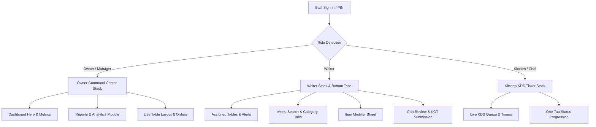

# Mobile Application Build & Architecture Specification

**Application Name**: Nodedr OrderRestro Mobile  
**Target Roles**: Operational Staff (**Waiter**, **Chef / Kitchen KDS**, and **Owner / Manager**)  
**Framework**: React Native 0.87.1 / Expo / React Native CLI  
**State Management**: React Context (`AuthContext` & `ThemeContext`) + Async Storage  
**Realtime Communications**: Socket.IO Client  
**Icon System**: Lucide Icons (`lucide-react-native`)  

---

## 1. Executive Summary & Design Philosophy

The Nodedr OrderRestro Mobile App is a commercial hospitality technology product. It provides a food-app quality visual language combined with enterprise operational efficiency.

**Key Philosophy**: *"POWERFUL UNDER THE HOOD, SIMPLE ON THE SURFACE."*

---

## 2. Dynamic Role-Based Stack Navigation

### Role Experience Matrix

| Role | Main Entry Screen | Key Capabilities |
| :--- | :--- | :--- |
| **Owner / Manager** | `OwnerHomeScreen` | Revenue Command Center, Date Filters (`Today`, `Yesterday`, `This Week`, `This Month`), Sparkline Trend Visuals, Quick Stats, Popular Dish Ranking, Dedicated Reports Hub (`OwnerReportsScreen`). |
| **Waiter** | `WaiterHomeScreen` | Home metrics, table layout grid, mobile menu search, category pills, modifier bottom sheet, cart review, KOT submission, live order status timeline, delivery confirmation, bill requests. |
| **Chef / Kitchen Staff** | `KitchenHomeScreen` | Live KDS queue, ticket timer counters, priority rush flags, order item modifiers, one-tap status pipeline (`[ ACCEPT ]` $\rightarrow$ `[ PREPARING ]` $\rightarrow$ `[ MARK READY ]`). |

---

## 3. Design System Architecture

Defined in `apps/mobile/src/theme/`:

- **Colors (`colors.ts`)**: Deep Emerald (`#059669` / `#10b981`), Warm Amber/Gold (`#f97316` / `#f59e0b`), Warm Off-White (`#f8fafc`), Deep Charcoal (`#090d16` / `#111827`).
- **Typography (`typography.ts`)**: Hierarchical scale (h1, h2, h3, h4, body, caption, tiny).
- **Spacing (`spacing.ts`)**: Consistent scale (xs: 4, sm: 8, md: 12, lg: 16, xl: 20, xxl: 24).
- **Radius (`radius.ts`)**: Rounded corner scale (sm: 6, md: 10, lg: 14, xl: 18, full: 9999).
- **Shadows (`shadows.ts`)**: Platform-optimized elevation shadows.
- **Animations (`animations.ts`)**: Timing scale (fast: 150ms, normal: 250ms, slow: 350ms) & spring presets.

---

## 4. Navigation & Floating Tab Bar

- **Floating Tab Bar** ([`FloatingTabBar.tsx`](file:///Users/mac/Projects/web/restaurant/apps/mobile/src/components/common/FloatingTabBar.tsx)): Rounded floating navigation container (`borderRadius: 24`) with theme-aware background, safe area bottom inset calculations via `useSafeAreaInsets()`, and elevated center action button `[ + NEW ORDER ]` for waiters.
- **Android Back Navigation** ([`useAndroidBackHandler.ts`](file:///Users/mac/Projects/web/restaurant/apps/mobile/src/hooks/useAndroidBackHandler.ts)):
  1. Closes open keyboard/search input
  2. Closes open modal / bottom sheet
  3. Pops navigation stack (`navigation.goBack()`)
  4. On root screen, requires double-tap back within 2 seconds before exiting app.

---

## 5. Build Verification

- **TypeScript Compilation**: `pnpm --filter mobile typecheck` — **Code 0 (Passed)**.
- **Android Emulator**: Verified on `Pixel_9_Pro` (`emulator-5554`) connected to Metro bundler on port `8081`.
- **Database Alignment**: Seeded demo accounts (`owner@demo.local`, `waiter@demo.local`, `chef@demo.local`, `kitchen@demo.local`, `cashier@demo.local`) with password `Password123!`.
