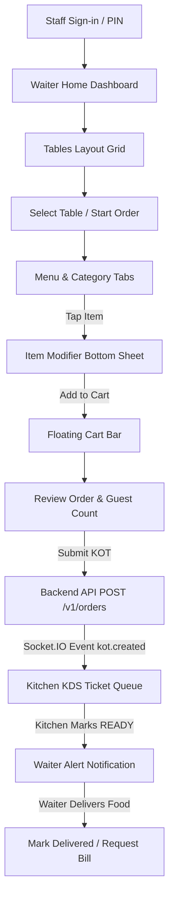

# Mobile Application Build & Architecture Specification

**Application Name**: Nodedr OrderRestro Mobile  
**Target Roles**: Operational Staff (**Waiter** & **Chef / Kitchen KDS**)  
**Framework**: React Native 0.87.1 / Expo  
**State Management**: React Context (`AuthContext`) + Async Storage  
**Realtime Communications**: Socket.IO Client  

---

## 1. Executive Summary & Design Philosophy

The Nodedr OrderRestro Mobile App is purpose-built for fast-paced, high-volume restaurant operations. Unlike enterprise dashboards designed for desktop browsers, this mobile application is streamlined for touch interaction on phones and handheld POS tablets.

**Key Philosophy**: *"POWERFUL UNDER THE HOOD, SIMPLE ON THE SURFACE."*

---

## 2. Role-Based Experience Architecture

| Role | Primary Entry Screen | Capabilities |
| :--- | :--- | :--- |
| **Waiter** | `WaiterHomeScreen` | Home metrics, table layout, menu item search, modifier bottom sheet, order cart review, KOT submission, live order status timeline, delivery confirmation, bill requests. |
| **Chef / Kitchen Staff** | `KitchenHomeScreen` | Live KDS queue, ticket timer counters, priority rush flags, order item modifiers, one-tap status progression (`[ ACCEPT ]` $\rightarrow$ `[ PREPARING ]` $\rightarrow$ `[ READY ]`). |
| **Manager / Owner** | `ManagerRestrictedScreen` | Staff mode notice directing owners to use the web dashboard for administrative analytics, inventory control, and financial reporting. |

---

## 3. Waiter Operational Workflow

---

## 4. Kitchen / KDS Operational Workflow

1. **Live KOT Receiver**: Socket.IO connection auto-subscribes to `branch:<branchId>` room on port 4001.
2. **Ticket Visual Queue**: High-contrast order ticket cards display:
   - Order Number & Table Number
   - Live elapsed timer counter (visual alert shift to red when > 15 mins)
   - Rush / Priority indicator (`🔥 RUSH`)
   - Item quantities in bold text with specific modification notes (e.g., *"Less spicy"*).
3. **One-Tap Pipeline**:
   - `[ ACCEPT KOT ]` $\rightarrow$ `[ PREPARING ]` $\rightarrow$ `[ MARK READY ]`
   - Realtime status update broadcast back to waiter app.

---

## 5. Mobile Design System

- **Primary Colors**: Emerald (`#10b981`), Amber (`#f97316`), Slate Background (`#090d16`).
- **Surface Elevation**: Dark high-contrast cards (`#111827`) with slate border accents (`#374151`).
- **Touch Ergonomics**: All actionable buttons feature a minimum height of 48px with generous internal padding to prevent accidental misclicks during rush hours.
- **Dietary Indicators**: Standard green square badge for Veg (`#16a34a`) and red square badge for Non-Veg (`#dc2626`).

---

## 6. Technical & Network Reliability

- **Socket.IO Resilience**: Automatic exponential backoff reconnect policy (10 attempts, 2-second intervals). Connection status pill (`ONLINE` 🟢 / `CONNECTING` 🟠 / `OFFLINE` 🔴) displayed on top bar.
- **Token Security**: JWT session stored securely via platform AsyncStorage (`@nodedr_mobile_token`), transmitted via HTTP Bearer headers and Socket.IO cookie handshake.
- **RBAC Authority**: Backend NestJS services retain full authority for authorization checks; mobile interface respects user permissions.

---

## 7. Build Verification & File Layout

- **Navigator**: `apps/mobile/src/navigation/AppNavigator.tsx`
- **Context**: `apps/mobile/src/context/AuthContext.tsx`
- **Services**: `apps/mobile/src/services/socket.ts`, `apps/mobile/src/api/client.ts`
- **Waiter Screens**: `WaiterHomeScreen`, `WaiterTablesScreen`, `WaiterMenuScreen`, `WaiterCartScreen`, `WaiterOrdersScreen`, `WaiterNotificationsScreen`, `WaiterProfileScreen`.
- **Kitchen Screens**: `KitchenHomeScreen`, `KitchenTicketCard`.
- **Typecheck**: Validated via `pnpm --filter mobile typecheck` (Code 0).
