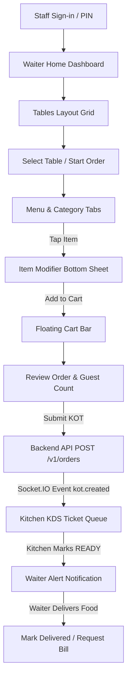

# Mobile Application Build & Architecture Specification

**Application Name**: Nodedr OrderRestro Mobile  
**Target Roles**: Operational Staff (**Waiter** & **Chef / Kitchen KDS**)  
**Framework**: React Native 0.87.1 / Expo / React Native CLI  
**State Management**: React Context (`AuthContext` & `ThemeContext`) + Async Storage  
**Realtime Communications**: Socket.IO Client  
**Icon System**: Lucide Icons (`lucide-react-native`)  

---

## 1. Executive Summary & Design Philosophy

The Nodedr OrderRestro Mobile App is purpose-built for fast-paced, high-volume restaurant operations. Unlike enterprise dashboards squeezed into mobile screens, this app provides a food-app quality visual language combined with enterprise operational efficiency.

**Key Philosophy**: *"POWERFUL UNDER THE HOOD, SIMPLE ON THE SURFACE."*

---

## 2. Design System Architecture

The application uses a centralized, semantic design system defined in `apps/mobile/src/theme/`:

```
src/
  theme/
    colors.ts      # Semantic light & dark mode color tokens
    typography.ts  # Hierarchical scale (h1, h2, h3, h4, body, caption, tiny)
    spacing.ts     # Consistent spacing scale (xs: 4, sm: 8, md: 12, lg: 16, xl: 20)
    radius.ts      # Corner radii tokens (sm: 6, md: 10, lg: 14, xl: 18, full: 9999)
    shadows.ts     # Platform-optimized elevation shadows (sm, md, lg)
    index.ts       # Master theme export & createTheme resolver
```

### Semantic Token Structure

| Token | Light Theme | Dark Theme | Purpose |
| :--- | :--- | :--- | :--- |
| `background` | `#f8fafc` | `#090d16` | Main screen background |
| `surface` | `#ffffff` | `#111827` | Primary card & container background |
| `surfaceSubtle` | `#f1f5f9` | `#1f2937` | Input & inset container background |
| `surfaceBorder` | `#e2e8f0` | `#374151` | Subtle divider & card borders |
| `textPrimary` | `#0f172a` | `#f9fafb` | High contrast headings & primary text |
| `textSecondary` | `#475569` | `#cbd5e1` | Subtitles & form labels |
| `textMuted` | `#64748b` | `#9ca3af` | Captions & inactive indicators |
| `primary` | `#10b981` | `#10b981` | Emerald brand accent & primary CTAs |
| `secondary` | `#f97316` | `#f97316` | Orange action accent (KOT / Rush) |
| `veg` | `#16a34a` | `#22c55e` | Green dietary tag |
| `nonVeg` | `#dc2626` | `#ef4444` | Red dietary tag |

---

## 3. Theme System & Dynamic Switching

- **Provider**: [`ThemeProvider`](file:///Users/mac/Projects/web/restaurant/apps/mobile/src/context/ThemeContext.tsx) supports 3 modes:
  1. `Light Mode`: Crisp off-white surfaces, emerald accents, dark typography.
  2. `Dark Mode`: Deep charcoal surfaces, high-contrast readable text.
  3. `System Default`: Automatically matches device system appearance (`useColorScheme`).
- **Persistence**: User selection is saved to AsyncStorage (`@orderrestro_theme_mode`).
- **UI Control**: Integrated [`ThemeToggle`](file:///Users/mac/Projects/web/restaurant/apps/mobile/src/components/common/ThemeToggle.tsx) on the Profile screen.

---

## 4. Reusable Design Components

Located in `apps/mobile/src/components/common/`:
- **`Button`**: Press feedback, minimum 48px touch height, loading spinner, variants (`primary`, `secondary`, `outline`, `ghost`, `danger`).
- **`Card`**: Theme-aware elevated container card.
- **`Input`**: Form input with focus highlight, helper text, error state, prefix/suffix icons.
- **`SearchBar`**: Search bar with clear button & Lucide search icon.
- **`StatusBadge`**: Theme-aware status chip for tables and order status pipeline.
- **`SkeletonLoader`**: Animated pulse placeholder for loading states instead of spinners.
- **`ThemeToggle`**: Light / Dark / System mode pill toggle.

---

## 5. Safe Area & Keyboard Handling

- **Safe Area**: Every screen consumes `useSafeAreaInsets()` from `react-native-safe-area-context` to adapt gracefully to Notches, Dynamic Island, status bar, and home indicators.
- **Keyboard Handling**: Form screens utilize `KeyboardAvoidingView` (with `Platform.OS === 'ios' ? 'padding' : undefined`) and `ScrollView` with `keyboardShouldPersistTaps="handled"`.

---

## 6. Role-Based Navigation & Workflow



---

## 7. Build Verification & File Layout

- **Theme System**: `colors.ts`, `typography.ts`, `spacing.ts`, `radius.ts`, `shadows.ts`, `ThemeContext.tsx`
- **Design Components**: `Button.tsx`, `Card.tsx`, `Input.tsx`, `SearchBar.tsx`, `StatusBadge.tsx`, `SkeletonLoader.tsx`, `ThemeToggle.tsx`
- **Waiter Screens**: `LoginScreen`, `WaiterHomeScreen`, `WaiterTablesScreen`, `WaiterMenuScreen`, `ItemModifierModal`, `WaiterCartScreen`, `WaiterOrdersScreen`, `WaiterNotificationsScreen`, `WaiterProfileScreen`
- **Kitchen Screens**: `KitchenHomeScreen`, `KitchenTicketCard`
- **Verification**: Validated via `pnpm --filter mobile typecheck` (Code 0) and executed on Android Emulator (`Pixel_9_Pro`).
