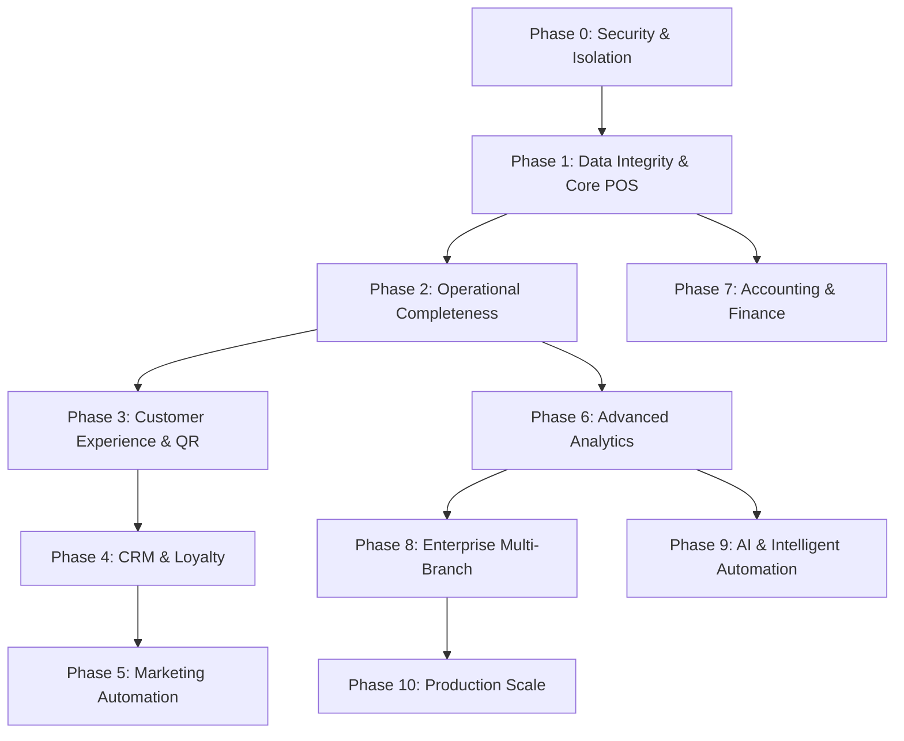

# RESTAURANT OPERATING SYSTEM (ROS) — MASTER PRODUCT BUILD STATUS & ROADMAP

> **Document Version:** 1.0.0  
> **Last Updated:** October 1, 2026  
> **Repository:** `nodedr-restaurant-pos` (`OrderRestro`)  
> **Target Architecture:** Multi-Tenant SaaS Restaurant Operating System (ROS)  

---

## EXECUTIVE SUMMARY

This document serves as the **Master Product Development Document** for transforming the existing codebase into an enterprise-grade, multi-tenant SaaS **Restaurant Operating System (ROS)**.

The system is built on a unified multi-tenant architecture:
- **One Shared Application** (`apps/web` Next.js frontend & `apps/mobile` React Native app)
- **One Shared Backend Service** (`apps/backend` NestJS service)
- **One Shared Database Instance** (PostgreSQL with Prisma ORM)
- **Strict Multi-Tenant Isolation** across every layer (database models, API guards, WebSockets, background tasks).

---

# 1. CURRENTLY BUILT FEATURES

This section lists features that are functionally implemented and verified in the codebase.

```
Status Legend:
  ✅ COMPLETE          Fully functional, tested, and ready for production use.
  🟡 PARTIAL           Core models/API exist, but missing UI or workflow depth.
  🔴 MISSING           No implementation exists in the current codebase.
  ⚠️ SECURITY ISSUE    Functional code exists but presents a tenant-isolation or security vulnerability.
```

---

## PLATFORM / SAAS INFRASTRUCTURE

### 1. Platform Admin & Authentication
- **Status:** ✅ COMPLETE
- **Description:** SuperAdmin dashboard for managing the SaaS platform. Includes email/password authentication using dedicated platform JWT sessions.
- **User Roles:** `SUPER_ADMIN`, `PLATFORM_ADMIN`, `PLATFORM_SUPPORT`, `PLATFORM_FINANCE`.
- **Frontend Area:** `apps/web/app/admin/*` (`/admin/login`, `/admin/dashboard`, `/admin/restaurants`)
- **Backend Module:** `src/platform/platform-auth.controller.ts`, `platform.module.ts`
- **Database Models:** `PlatformUser`, `PlatformRole`
- **Realtime Functionality:** None.
- **Limitations:** Multi-factor authentication (MFA/2FA) is not enforced for platform admins.

### 2. Tenant Enrollment & Restaurant Management
- **Status:** ✅ COMPLETE
- **Description:** Public restaurant signup (`/register`) and admin-facing tenant lifecycle management. Admin can create, approve, activate, suspend, or decommission tenant restaurants.
- **User Roles:** `SUPER_ADMIN`, `PLATFORM_ADMIN`, Public Restaurant Owner.
- **Frontend Area:** `apps/web/app/register/page.tsx`, `apps/web/app/admin/restaurants/page.tsx`
- **Backend Module:** `src/modules/public/public-register.controller.ts`, `src/platform/platform-restaurants.controller.ts`
- **Database Models:** `Restaurant`, `Branch`, `User`, `Role`, `Subscription`
- **Realtime Functionality:** None.
- **Limitations:** Automated email verification upon registration is currently mocked/bypassed.

### 3. Subscription & Plan Engine
- **Status:** ✅ COMPLETE
- **Description:** Subscription tier management (`Plan` CRUD: Starter, Growth, Enterprise) with customizable resource limits (`maxBranches`, `maxUsers`, `maxTables`, `maxProducts`) and feature flag array (`features`). Supports monthly, quarterly, half-yearly, and yearly billing periods.
- **User Roles:** `SUPER_ADMIN`, `PLATFORM_ADMIN`, `PLATFORM_FINANCE`.
- **Frontend Area:** `apps/web/app/admin/plans/page.tsx`, `apps/web/app/admin/subscriptions/page.tsx`, `apps/web/app/pricing/page.tsx`
- **Backend Module:** `src/platform/platform-plans.controller.ts`, `src/platform/platform-subscriptions.controller.ts`, `src/modules/public/public-plans.controller.ts`
- **Database Models:** `Plan`, `Subscription`, `SubscriptionStatus`, `BillingPeriod`
- **Realtime Functionality:** None.
- **Limitations:** Recurring auto-debit payments via payment gateways (Stripe/Razorpay) are not yet integrated; currently relies on manual payment recording or trial states.

### 4. Invoicing & Manual Payment Recording
- **Status:** ✅ COMPLETE
- **Description:** Generates subscription invoices (`SubscriptionInvoice`) with invoice numbers, line items, tax, discounts, and payment records (`SubscriptionPayment`). Supports manual offline payments (Cash, Bank Transfer, UPI, Cheque).
- **User Roles:** `PLATFORM_ADMIN`, `PLATFORM_FINANCE`.
- **Frontend Area:** `apps/web/app/admin/invoices/page.tsx`, `apps/web/app/admin/payments/page.tsx`
- **Backend Module:** `src/platform/platform-invoices.controller.ts`, `src/platform/platform-payments.controller.ts`
- **Database Models:** `SubscriptionInvoice`, `SubscriptionPayment`, `SubscriptionPaymentMethod`
- **Realtime Functionality:** None.
- **Limitations:** Payment gateway webhooks (Stripe/Razorpay) are not active.

### 5. Entitlement & Usage Limit Enforcement
- **Status:** ✅ COMPLETE
- **Description:** Centralized NestJS service (`EntitlementService`) and guard (`SubscriptionGuard`) that evaluates tenant subscription status, active dates, feature keys, and resource count ceilings (branches, users, tables, menu items) before processing mutations.
- **User Roles:** All Tenant Users.
- **Frontend Area:** `apps/web/app/(dashboard)/*` (displays upgrade banners when limit reached)
- **Backend Module:** `src/common/services/entitlement.service.ts`, `src/common/guards/subscription.guard.ts`
- **Database Models:** `Subscription`, `Plan`
- **Realtime Functionality:** None.
- **Limitations:** Read-only requests (GET) are intentionally permitted even if a subscription is expired.

### 6. Platform Audit Logging
- **Status:** ✅ COMPLETE
- **Description:** Tracks platform administrator actions (tenant approvals, plan changes, manual payment entries) with user metadata and action logs.
- **User Roles:** `SUPER_ADMIN`, `PLATFORM_ADMIN`.
- **Frontend Area:** Exposed in admin dashboard tables.
- **Backend Module:** `src/platform/platform-dashboard.controller.ts`
- **Database Models:** `PlatformAuditLog`
- **Realtime Functionality:** None.
- **Limitations:** Exporting platform audit logs to CSV/PDF is not built.

---

## RESTAURANT OPERATIONAL MODULES

### 7. Restaurant Profile & Multi-Branch Architecture
- **Status:** ✅ COMPLETE
- **Description:** Multi-branch tenant configuration. Defines restaurant tax rules, currency (default INR), timezone, logo, GST numbers, and per-branch settings.
- **User Roles:** Restaurant `OWNER`, `MANAGER`.
- **Frontend Area:** `apps/web/app/(dashboard)/settings/page.tsx`
- **Backend Module:** `src/modules/restaurants/branches.controller.ts`, `src/modules/settings/settings.controller.ts`
- **Database Models:** `Restaurant`, `Branch`
- **Realtime Functionality:** None.
- **Limitations:** Branch switching changes active context, but cross-branch inventory transfers are not yet supported.

### 8. Staff Management & Role-Based Access Control (RBAC)
- **Status:** ✅ COMPLETE
- **Description:** Granular permission system. 11 seeded system roles (`OWNER`, `MANAGER`, `CASHIER`, `WAITER`, `KITCHEN`, `BAR`, `STORE_MANAGER`, `HOST`, `ACCOUNTANT`, `MARKETING`, `DELIVERY_DRIVER`) plus support for custom role creation. Supports quick PIN switch for shared terminals.
- **User Roles:** `OWNER`, `MANAGER`.
- **Frontend Area:** `apps/web/app/(dashboard)/settings/users/page.tsx`
- **Backend Module:** `src/modules/users/users.controller.ts`, `src/roles/roles.controller.ts`, `src/permissions/`
- **Database Models:** `User`, `Role`, `Permission`, `RolePermission`, `UserBranch`
- **Realtime Functionality:** Staff status changes can revoke active socket connections.
- **Limitations:** User invitations via email link are missing; users are directly created with passwords/PINs.

### 9. Floor Plans & Table Management
- **Status:** ✅ COMPLETE
- **Description:** Floor creation (`Floor`), spatial table positioning (`posX`, `posY`, `width`, `height`, `shape`, `rotation`), table status tracking (`AVAILABLE`, `OCCUPIED`, `RESERVED`, `CLEANING`, `OUT_OF_SERVICE`), assigned waiter linking, and unique table QR token generation.
- **User Roles:** `OWNER`, `MANAGER`, `HOST`, `WAITER`, `CASHIER`.
- **Frontend Area:** `apps/web/app/(dashboard)/tables/page.tsx`
- **Backend Module:** `src/modules/tables/tables.controller.ts`
- **Database Models:** `Floor`, `Table`, `TableStatus`
- **Realtime Functionality:** Live WebSocket broadcasts (`table.updated`) when table status changes.
- **Limitations:** Drag-and-drop floor builder canvas UI is not connected to the backend PATCH coordinates endpoint.

### 10. Menu & Catalog Management
- **Status:** ✅ COMPLETE
- **Description:** Menu categorization, item pricing (tax-inclusive), tax rates, prep time, dietary tags (`isVeg`, `isVegan`, `isJain`, `isHalal`, `isGlutenFree`), spice level, allergen tags, photo upload, modifier groups (`minSelect`, `maxSelect`, `isRequired`), nested modifiers with price adjustments, combo bundles (`ComboComponent`), and recipe ingredient links.
- **User Roles:** `OWNER`, `MANAGER`, `KITCHEN`.
- **Frontend Area:** `apps/web/app/(dashboard)/menu/page.tsx`
- **Backend Module:** `src/modules/menu/menu.controller.ts`
- **Database Models:** `MenuCategory`, `MenuItem`, `ModifierGroup`, `Modifier`, `MenuItemModifierGroup`, `ComboComponent`, `RecipeIngredient`
- **Realtime Functionality:** Live WebSocket updates (`menu.updated`) broadcast to POS terminals.
- **Limitations:** Time-of-day scheduled menus (day-parting e.g. Breakfast vs Dinner menu) and branch-specific item pricing are missing.

### 11. Core POS Checkout & Order Engine
- **Status:** ✅ COMPLETE
- **Description:** Touch-friendly POS screen for dine-in, takeaway, and delivery orders. Item search, category filter, modifier selection, cart management, line item snapshotting (`nameSnapshot`, `unitPriceSnapshot`, `taxRateSnapshot`), discount (% / flat), tip addition, order notes, KOT ticket generation, and thermal receipt printing layout.
- **User Roles:** `CASHIER`, `WAITER`, `MANAGER`, `OWNER`.
- **Frontend Area:** `apps/web/app/(dashboard)/pos/page.tsx`
- **Backend Module:** `src/modules/orders/orders.controller.ts`, `src/modules/billing/billing.controller.ts`
- **Database Models:** `Order`, `OrderItem`, `OrderItemModifier`, `OrderType`, `OrderStatus`
- **Realtime Functionality:** Live WebSocket events (`order.created`, `order.updated`, `order.billed`) sent to KDS and waiter screens.
- **Limitations:** Order split (by seat/item) and multi-tender split payments (e.g. paying half cash and half UPI on a single check) are display-only or unavailable.

### 12. POS Register Shifts & Cash Drawer Reconciliation
- **Status:** ✅ COMPLETE
- **Description:** Register shift lifecycle (`RegisterShift`: `OPEN`, `CLOSED`). Tracks starting float, cash sales, card sales, UPI sales, cash refunds, paid-in/paid-out movements (`ShiftCashMovement`), expected cash vs actual counted cash, and cash overage/shortage calculation.
- **User Roles:** `CASHIER`, `MANAGER`, `OWNER`.
- **Frontend Area:** `apps/web/app/(dashboard)/pos/shift-modal.tsx` (accessible from POS header)
- **Backend Module:** `src/modules/shifts/shifts.controller.ts`
- **Database Models:** `RegisterShift`, `ShiftCashMovement`, `ShiftStatus`, `CashMovementType`
- **Realtime Functionality:** None.
- **Limitations:** Automated USB cash-drawer kick trigger relies on browser print events.

### 13. Kitchen Display System (KDS) & KOT Routing
- **Status:** ✅ COMPLETE
- **Description:** Live kitchen screen displaying tickets categorized by station (`KitchenStation`). Ticket status progression (`NEW` → `ACCEPTED` → `PREPARING` → `READY` → `SERVED`), priority toggle, elapsed prep time timer with visual 15-minute warning alert ring, and station-specific KOT splitting.
- **User Roles:** `KITCHEN`, `BAR`, `CHEF`, `MANAGER`.
- **Frontend Area:** `apps/web/app/(dashboard)/kds/page.tsx`
- **Backend Module:** `src/modules/kds/kds.controller.ts`
- **Database Models:** `Kot`, `KotItem`, `KitchenStation`, `KotStatus`, `KotItemStatus`
- **Realtime Functionality:** Real-time Socket.IO events (`kot.created`, `kot.updated`, `kot.status_changed`).
- **Limitations:** Item-level prep timer breakdown and automated audio delay escalation alerts are missing.

### 14. Inventory Management & Auto Recipe Deduction
- **Status:** ✅ COMPLETE
- **Description:** Ingredient master list with base units (`KG`, `G`, `L`, `ML`, `PIECE`, `BOX`), weighted-average costing (WAC), current stock tracking, reorder levels, stock adjustments, batch/expiry tracking (`StockBatch`), reason-coded waste logs (`WasteLog`), and automated FIFO ingredient stock deduction upon order payment.
- **User Roles:** `STORE_MANAGER`, `MANAGER`, `OWNER`.
- **Frontend Area:** `apps/web/app/(dashboard)/inventory/page.tsx`
- **Backend Module:** `src/modules/inventory/inventory.controller.ts`
- **Database Models:** `Ingredient`, `RecipeIngredient`, `StockBatch`, `StockMovement`, `WasteLog`, `StockMovementType`, `WasteReason`
- **Realtime Functionality:** None.
- **Limitations:** Unit conversion engine (e.g. purchasing in 25kg bags but deducting in grams) is missing; requires purchasing and stocking in the same base unit.

### 15. Procurement System (PO, GRN, Invoices & Supplier Payments)
- **Status:** ✅ COMPLETE
- **Description:** Complete supplier procurement lifecycle: Supplier registry, Purchase Requests (`PurchaseRequest`), Supplier Quotations (`SupplierQuotation`), Purchase Orders (`PurchaseOrder`), Goods Receipt Notes (`GoodsReceipt` / GRN with batch & expiry entry), Supplier Invoices (`SupplierInvoice`), and Supplier Payments (`SupplierPayment`). Auto-recomputes ingredient weighted average cost upon GRN approval.
- **User Roles:** `STORE_MANAGER`, `PURCHASING_OFFICER`, `MANAGER`, `OWNER`.
- **Frontend Area:** `apps/web/app/(dashboard)/inventory/procurement/`
- **Backend Module:** `src/modules/inventory/inventory.controller.ts` (sub-routes for procurement)
- **Database Models:** `Supplier`, `PurchaseRequest`, `SupplierQuotation`, `PurchaseOrder`, `GoodsReceipt`, `SupplierInvoice`, `SupplierPayment`
- **Realtime Functionality:** None.
- **Limitations:** Automated reorder PO generation based on low-stock triggers is missing.

### 16. Customer CRM & Gift Cards
- **Status:** ✅ COMPLETE
- **Description:** Customer directory with phone lookup, visit history, birthday, anniversary, allergen notes, loyalty points accumulation, wallet balance, and gift card generation/redemption (`GiftCard`, `GiftCardRedemption`).
- **User Roles:** `CASHIER`, `HOST`, `MANAGER`, `OWNER`.
- **Frontend Area:** `apps/web/app/(dashboard)/customers/page.tsx`
- **Backend Module:** `src/modules/customers/customers.controller.ts`, `src/modules/gift-cards/gift-cards.controller.ts`
- **Database Models:** `Customer`, `GiftCard`, `GiftCardRedemption`
- **Realtime Functionality:** None.
- **Limitations:** Automated RFM (Recency, Frequency, Monetary) segmentation and customer portal login are missing.

### 17. Reservations & Waitlist Management
- **Status:** ✅ COMPLETE
- **Description:** Table reservation booking system (`RESERVED`, `CONFIRMED`, `ARRIVED`, `COMPLETED`, `CANCELLED`, `NO_SHOW`), guest count, duration, special requests, optional deposit recording, and live walk-in waitlist queue (`WaitlistEntry`) with estimated wait times and table seating flow.
- **User Roles:** `HOST`, `WAITER`, `MANAGER`, `OWNER`.
- **Frontend Area:** `apps/web/app/(dashboard)/reservations/page.tsx`
- **Backend Module:** `src/modules/reservations/reservations.controller.ts`, `src/modules/waitlist/waitlist.controller.ts`
- **Database Models:** `Reservation`, `WaitlistEntry`, `ReservationStatus`, `WaitlistStatus`
- **Realtime Functionality:** WebSocket updates (`reservation.updated`, `waitlist.updated`) sync across host stands.
- **Limitations:** SMS/WhatsApp automated booking confirmation and reminder dispatch are missing.

### 18. In-App Notification Engine
- **Status:** ✅ COMPLETE
- **Description:** Real-time topbar bell notification system. Supports permission-gated targeted broadcasts (e.g. notifying staff with `orders.create` permission) and individual user targeting.
- **User Roles:** All Staff Users.
- **Frontend Area:** Topbar header notification drawer across dashboard layout.
- **Backend Module:** `src/notifications/notifications.controller.ts`, `src/notifications/notifications.service.ts`
- **Database Models:** `Notification`
- **Realtime Functionality:** Socket.IO events (`notification.created`) emitted directly to recipient user rooms.
- **Limitations:** Push notifications (Web Push / FCM) are not configured.

### 19. Developer API & Model Context Protocol (MCP) Integration
- **Status:** ✅ COMPLETE
- **Description:** Dual API key architecture: Staff API Keys (`StaffApiKey`) for personal tools/MCP server access, and Integration API Keys (`IntegrationApiKey`) with explicit scopes (`orders:read`, `menu:write`) for external aggregators/partners. Built-in MCP endpoints for AI agent access.
- **User Roles:** `OWNER`, Developers, AI Agents.
- **Frontend Area:** `apps/web/app/(dashboard)/settings/integrations/page.tsx`
- **Backend Module:** `src/integrations/`, `src/mcp/`
- **Database Models:** `StaffApiKey`, `IntegrationApiKey`
- **Realtime Functionality:** None.
- **Limitations:** Rate limiting per API key is not currently enforced.

---

# 2. PARTIALLY BUILT FEATURES

The following features have database models or partial backend endpoints in place, but lack complete frontend UI, end-to-end workflows, or operational depth.

```
┌───────────────────────────┬───────────────────────────────────┬───────────────────────────────────┐
│ Feature                   │ What Currently Exists             │ What Is Missing / Needs Build     │
├───────────────────────────┼───────────────────────────────────┼───────────────────────────────────┤
│ Customer QR Self-Order    │ • Public menu page                │ • Add to cart & checkout flow     │
│                           │   `/order/[qrToken]`              │ • Live order status tracking UI   │
│                           │ • Table QR token generator        │ • Online payment integration      │
│                           │ • Read-only menu display          │ • Waiter call & bill request buttons│
├───────────────────────────┼───────────────────────────────────┼───────────────────────────────────┤
│ Split Billing & Payments  │ • Equal split calculation in POS  │ • Split order into per-guest checks│
│                           │ • `Payment` model supports        │ • Split by specific item/seat     │
│                           │   `payerName`                     │ • Multi-tender check payments     │
├───────────────────────────┼───────────────────────────────────┼───────────────────────────────────┤
│ Multi-Branch Staff        │ • `UserBranch` junction model     │ • Branch access guard enforcing   │
│ Scoping                   │ • Branch selection dropdown in UI │   `UserBranch` permissions        │
│                           │                                   │ • Multi-branch staff schedule     │
├───────────────────────────┼───────────────────────────────────┼───────────────────────────────────┤
│ Interactive Floor Canvas  │ • `posX`, `posY`, `width`,        │ • Visual drag-and-drop table UI   │
│                           │   `height`, `shape`, `rotation`   │ • Snap-to-grid floor layout canvas│
│                           │ • Backend PATCH endpoint          │ • Wall/obstacle drawing tools     │
├───────────────────────────┼───────────────────────────────────┼───────────────────────────────────┤
│ Reporting & Analytics     │ • Dashboard metrics widgets       │ • Exportable sales reports        │
│                           │ • Sales overview API              │ • Food cost percentage reports    │
│                           │                                   │ • Staff performance & tips report │
│                           │                                   │ • Multi-branch comparative charts │
├───────────────────────────┼───────────────────────────────────┼───────────────────────────────────┤
│ Waiter, Kitchen & Owner Mobile App│ • Production React Native app     │ • Owner Command Center Dashboard  │
│                           │ • Waiter Home, Tables, Menu, Cart │   (Revenue, Sparklines, Filters)  │
│                           │ • Item Modifier Bottom Sheet      │ • Executive Reports & Analytics   │
│                           │ • KDS Queue & Ticket Cards        │ • Floating Tab Bar & Android Back │
├───────────────────────────┼───────────────────────────────────┼───────────────────────────────────┤
│ Menu Availability & Prep  │ • `prepTimeMinutes` field         │ • KDS prep timer warning based    │
│ Time                      │ • `availableFrom` & `availableTo` │   on item prep time               │
│                           │   time strings                    │ • Automatic item disable when out │
│                           │                                   │   of window                       │
└───────────────────────────┴───────────────────────────────────┴───────────────────────────────────┘
```

---

# 3. MISSING FEATURES

The following features have **no implementation** in the repository and represent required product scope.

### TABLE OPERATIONS
- 🔴 Table Split (splitting one table into two active sub-tables)
- 🔴 Table Transfer / Move (moving an active order from Table A to Table B with history)
- 🔴 Guest & Seat Management (assigning items to specific seat numbers: Seat 1, Seat 2)
- 🔴 Table Utilization Rate Analytics (tracking turn times and seated occupancy %)

### ORDER MANAGEMENT
- 🔴 Seat-Based Ordering & Split Ordering (placing distinct orders per seat)
- 🔴 Course-Based Ordering (Appetizer, Main, Dessert firing rules)
- 🔴 Item Hold & Fire System (delaying kitchen submission for specific items)
- 🔴 86 / Quick Out-of-Stock Sync (one-tap instant item disabling across POS and QR)
- 🔴 Rush Mode / Order Throttling (limiting incoming orders during peak kitchen load)

### BILLING & CASHIERING
- 🔴 Granular Split Billing (split by seat, split by selected items, split by percentage)
- 🔴 Multi-Tender Payment Execution (e.g. $20 Cash + $30 Card on single invoice)
- 🔴 Manager Void & Discount Authorization Flow (supervisor PIN approval modal for voids/discounts)
- 🔴 Cash Drawer Hardware Kick Trigger (direct serial/USB drawer integration)

### KITCHEN OPERATIONS
- 🔴 Automated Kitchen SLA Delay Escalation Alerts (audio/visual alerts when ticket exceeds target time)
- 🔴 Item-Level Kitchen Bump (bumping individual items off a ticket as they complete)
- 🔴 Expediter / Pass Display Screen (consolidating station output before serving)
- 🔴 Kitchen Throughput Analytics (items prepared per hour per station)

### STAFF & HR
- 🔴 Staff Email Invitation & Self-Onboarding Flow
- 🔴 Drag-and-Drop Shift Scheduling & Roster Management
- 🔴 Timeclock Punch In / Punch Out with PIN
- 🔴 Tip Tracking & Automatic Tip Distribution (pooling by shift/hours)
- 🔴 Waiter Performance Analytics (sales per hour, average table turnover, tip totals)

### MENU MANAGEMENT
- 🔴 Day-Parting / Time-Scheduled Menus (Breakfast, Lunch, Dinner, Happy Hour automatics)
- 🔴 Seasonal & Date-Ranged Menu Profiles
- 🔴 Branch-Specific Menu Pricing & Item Overrides
- 🔴 Contribution Margin & Menu Engineering Matrix (Stars, Plowhorses, Puzzles, Dogs)

### ADVANCED INVENTORY
- 🔴 Inter-Branch Stock Transfers & Requisitions
- 🔴 Physical Stocktake Variance Audit (System Stock vs Counted Stock reconciliation)
- 🔴 Stock Expiry Push Alerts & Spoilage Prevention Dashboard
- 🔴 Unit Conversion Engine (Purchase Unit vs Stock Unit vs Recipe Unit)
- 🔴 Theoretical vs Actual Consumption Analysis (identifying theft/untracked waste)

### CRM & GUEST INSIGHTS
- 🔴 Automated RFM Segmentation (Recency, Frequency, Monetary scoring)
- 🔴 Customer Lifetime Value (LTV) Calculation & Top-Spender Tags
- 🔴 At-Risk Customer Automated Identification
- 🔴 Guest Allergen & Preference Auto-Pop alerts on POS order creation

### LOYALTY & REWARDS
- 🔴 Tiered Loyalty Levels (Silver, Gold, Platinum with multiplier earn rates)
- 🔴 Digital Stamp Cards & Visit Streaks
- 🔴 Birthday & Anniversary Automated Reward Trigger
- 🔴 Customer Referral Engine & Unique Referral Codes

### RESERVATIONS & WAITLIST
- 🔴 Online Table Booking Deposit Payment Gateway Integration
- 🔴 Automated SMS / WhatsApp Booking Confirmation & 1-Hour Reminder
- 🔴 Automated No-Show Status Triggering & Blacklist Management

### CUSTOMER EXPERIENCE & QR
- 🔴 Full Table Self-Ordering & Checkout via QR (Scan, Order, Pay at Table)
- 🔴 Customer Waiter Call & Service Buttons (Call Waiter, Request Bill, Request Water)
- 🔴 Guest Digital Order History & Instant Electronic Receipts (SMS/WhatsApp/Email)
- 🔴 Guest Feedback & Service Recovery Workflow (1-5 Star rating prompt after payment)

### MARKETING AUTOMATION
- 🔴 Campaign Builder (SMS, Email, WhatsApp promo dispatch)
- 🔴 Coupon Code & Promo Engine (e.g. `SUMMER20`, flat discount, BOGO)
- 🔴 Segmented Customer Target Marketing (e.g. send coupon to guests absent for >30 days)

### ANALYTICS & BUSINESS INTELLIGENCE
- 🔴 Consolidated Multi-Branch Executive Performance Dashboard
- 🔴 Food Cost Percentage & COGS Analytics
- 🔴 Table Turnover Rate & Revenue Per Available Seat Hour (RevPASH)
- 🔴 Product Profitability Matrix & Hourly Sales Heatmaps

### ACCOUNTING & FINANCIAL MANAGEMENT
- 🔴 Expense Tracker & Operational Overhead Logging (Rent, Utilities, Salaries)
- 🔴 Cost of Goods Sold (COGS) & Gross Profit Reports
- 🔴 Profit & Loss (P&L) Statement Generator
- 🔴 Tally / QuickBooks / Zoho Books CSV Export Integration

### PUBLIC RESTAURANT WEB PRESENCE
- 🔴 Customizable Branded Public Restaurant Website
- 🔴 Public Menu Viewer with Direct Online Reservations
- 🔴 Custom Domain Routing Architecture (`restaurantname.com`)

### ARTIFICIAL INTELLIGENCE (AI)
- 🔴 AI Predictive Sales & Demand Forecasting
- 🔴 AI Intelligent Inventory Reorder Quantity Prediction
- 🔴 AI Menu Price & Dynamic Margin Optimizer
- 🔴 AI Natural Language Business Assistant (Conversational Querying over Sales/Stock)

---

# 4. CRITICAL SECURITY & ARCHITECTURE ISSUES

The following security risks and architectural gaps were identified during inspection of the codebase.

```
> [!NOTE]
> All Phase 0 Security & Tenant-Isolation vulnerabilities have been RESOLVED and HARDENED in Phase 0A (October 2026).
```

### 1. ✅ DECOMMISSIONED DATABASE BACKUP/RESTORE CONTROLS (RESOLVED)
- **Location:** `apps/backend/src/backup/backup.service.ts`
- **Resolution:** Purged `pg_restore` execution and `child_process` restore logic from NestJS application services. `BackupService.restore()` explicitly throws `ForbiddenException`. Restore operations are managed exclusively out-of-band by platform infrastructure.

### 2. ✅ DECOMMISSIONED SYSTEM UPDATE & DOCKER SOCKET EXECUTION (RESOLVED)
- **Location:** `apps/backend/src/system/update.service.ts`
- **Resolution:** Purged host `docker` CLI execution and mounted socket helper container logic. `UpdateService.applyUpdate()` explicitly throws `ForbiddenException`.

### 3. ✅ BRANCH ISOLATION GUARD HARDENING (RESOLVED)
- **Location:** `apps/backend/src/common/services/branch-access.service.ts`
- **Resolution:** Enhanced `BranchAccessService.assertAccess(restaurantId, branchId, userId)` to verify `UserBranch` staff assignments for non-owner roles. Blocks unauthorized branch access across all controllers and WebSockets.

### 4. ✅ PUBLIC QR CODE TOKEN AUTHORIZATION FOUNDATION (RESOLVED)
- **Location:** `apps/backend/src/modules/public/public-menu.service.ts`
- **Resolution:** Implemented signed JWT table session token generation (`tableSessionToken`) bound to `restaurantId`, `branchId`, and `tableId` with `verifyTableSessionToken` validation.

### 5. ✅ WEBSOCKET REALTIME ROOM ISOLATION (RESOLVED)
- **Location:** `apps/backend/src/realtime/realtime.gateway.ts`
- **Resolution:** Integrated `user.id` into `branchAccess.assertAccess` during WebSocket handshake to prevent unauthorized staff from joining branch rooms.

### 6. ✅ BACKGROUND SCHEDULED JOBS TENANT CONTEXT (RESOLVED)
- **Location:** `apps/backend/src/common/services/tenant-context.service.ts`
- **Resolution:** Created `TenantContextService` with `runInTenantContext` and `runForAllActiveTenants` methods to isolate tenant contexts during background job execution.

---

# 5. RECOMMENDED BUILD ORDER (DEPENDENCY-AWARE ROADMAP)

Implementation sequence designed around technical dependencies.



---

## PHASE 0 — SECURITY HARDENING & TENANT ISOLATION
- **Objective:** Eliminate security vulnerabilities and enforce strict tenant/branch data boundaries.
- **Key Deliverables:**
  1. Purge `pg_restore` and Docker CLI execution code from application backend services.
  2. Tighten `BranchAccessService` to enforce `UserBranch` staff assignments.
  3. Audit all database query handlers to guarantee `restaurantId` filter scoping on every Prisma call.
  4. Secure WebSocket emission channels to prevent data leaks.
- **Dependencies:** None.
- **Impacted Modules:** `src/common/guards`, `src/common/services`, `src/backup`, `src/system`, `src/realtime`.

## PHASE 1 — DATA INTEGRITY & CORE HARDENING
- **Objective:** Ensure POS billing, cash drawer management, and recipe deductions operate with zero financial or stock drift.
- **Key Deliverables:**
  1. Implement POS Split Payment execution (Multi-Tender: Cash + Card + UPI on single check).
  2. Implement Manager Approval Modal for Voids, Refunds, and Custom Discounts.
  3. Add stock intake unit conversion engine (Purchase Unit → Base Stock Unit).
  4. Implement physical stocktake variance logging.
- **Dependencies:** Phase 0.
- **Impacted Modules:** `src/modules/orders`, `src/modules/billing`, `src/modules/shifts`, `src/modules/inventory`.

## PHASE 2 — RESTAURANT OPERATIONAL COMPLETENESS
- **Objective:** Complete table operations, KDS delay handling, and floor plan design tools.
- **Key Deliverables:**
  1. Connect interactive floor canvas drag-and-drop table positioning UI.
  2. Implement Table Transfer (Move Order from Table A to Table B) and Table Split.
  3. Build KDS Audio/Visual SLA Delay Alerts & Expediter Pass Display Screen.
  4. Implement Item 86 (Instant Out-of-Stock toggle) across POS & KDS.
- **Dependencies:** Phase 1.
- **Impacted Modules:** `src/modules/tables`, `src/modules/orders`, `src/modules/kds`.

## PHASE 3 — CUSTOMER EXPERIENCE & QR SELF-ORDERING
- **Objective:** Turn read-only digital menus into a complete guest ordering and payment portal.
- **Key Deliverables:**
  1. Build Guest Add-to-Cart, Modifier Selection, and Checkout on `/order/[qrToken]`.
  2. Integrate online payment gateway (Razorpay / Stripe) for QR table checkout.
  3. Build Guest Service Call buttons (Call Waiter, Request Bill, Request Water).
  4. Live guest order progress status tracking UI.
- **Dependencies:** Phase 2.
- **Impacted Modules:** `src/modules/public`, `apps/web/app/order/[qrToken]`.

## PHASE 4 — CRM, LOYALTY & GUEST ENGAGEMENT
- **Objective:** Build guest profiles, loyalty rewards engine, and automated retention triggers.
- **Key Deliverables:**
  1. Implement Tiered Loyalty Program (Earn rates, Redemption rules, Tier benefits).
  2. Implement Automated RFM Customer Segmentation engine.
  3. Build Digital Stamp Cards and Birthday Reward automation.
  4. POS guest allergen and preference auto-pop integration.
- **Dependencies:** Phase 3.
- **Impacted Modules:** `src/modules/customers`, `src/modules/billing`.

## PHASE 5 — MARKETING AUTOMATION
- **Objective:** Enable targeted marketing campaigns and promotional coupon engines.
- **Key Deliverables:**
  1. Promo Code & Coupon Engine (`SUMMER20`, Flat/Percentage, Item-specific).
  2. SMS / Email / WhatsApp campaign builder integrated with CRM segments.
  3. Campaign conversion and ROI tracking analytics.
- **Dependencies:** Phase 4.
- **Impacted Modules:** New `src/modules/marketing`.

## PHASE 6 — ADVANCED ANALYTICS & REPORTING
- **Objective:** Deliver executive dashboards, menu engineering matrices, and operational analytics.
- **Key Deliverables:**
  1. Sales, Revenue, and Food Cost % Exportable Reports (PDF/CSV/Excel).
  2. Menu Engineering Matrix (Stars, Plowhorses, Puzzles, Dogs profitability analysis).
  3. Waiter performance, tip allocation, and table turnover rate charts.
- **Dependencies:** Phase 2.
- **Impacted Modules:** `src/modules/dashboard`, `src/modules/orders`, `src/modules/inventory`.

## PHASE 7 — ACCOUNTING & FINANCIAL MANAGEMENT
- **Objective:** Provide operational accounting, expense tracking, and P&L generation.
- **Key Deliverables:**
  1. Expense logging module (Rent, Utilities, Maintenance, Payroll overhead).
  2. Automated Profit & Loss (P&L) Statement calculation (Revenue - COGS - Expenses).
  3. Tally / QuickBooks / CSV accounting export integration.
- **Dependencies:** Phase 1, Phase 6.
- **Impacted Modules:** New `src/modules/accounting`.

## PHASE 8 — ENTERPRISE MULTI-BRANCH
- **Objective:** Scale operations for multi-location restaurant chains and franchises.
- **Key Deliverables:**
  1. Inter-Branch Inventory Transfer Requisitions & Dispatch tracking.
  2. Consolidated Multi-Branch Executive Dashboard with location comparison.
  3. Centralized Master Menu distribution to selected branches.
- **Dependencies:** Phase 6.
- **Impacted Modules:** `src/modules/restaurants`, `src/modules/inventory`, `src/modules/menu`.

## PHASE 9 — ARTIFICIAL INTELLIGENCE & INTELLIGENT AUTOMATION
- **Objective:** Integrate predictive AI for demand forecasting and conversational reporting.
- **Key Deliverables:**
  1. AI Sales & Revenue Predictive Forecasting engine.
  2. AI Automated Inventory Reorder Quantity Advisor.
  3. AI Conversational Business Assistant (Natural Language queries over sales/stock).
- **Dependencies:** Phase 6, Phase 7.
- **Impacted Modules:** `src/mcp`, new `src/modules/ai`.

## PHASE 10 — PRODUCTION HARDENING & SCALE
- **Objective:** Optimize system performance, infrastructure resilience, and disaster recovery.
- **Key Deliverables:**
  1. Redis Caching layer for public menus and session tokens.
  2. Database read-replica configuration for heavy analytics queries.
  3. End-to-end automated load testing & security penetration testing.
- **Dependencies:** All preceding phases.
- **Impacted Modules:** Infrastructure, NestJS core providers.

---

# 6. MASTER FEATURE CHECKLIST

### Platform SaaS Infrastructure
- [x] Platform Admin Authentication & JWT Session
- [x] Restaurant Tenant Signup & Enrollment
- [x] Tenant Activation & Suspension Controls
- [x] Subscription Tier / Plan CRUD Management
- [x] Subscription Invoicing & Manual Payment Logging
- [x] Entitlement & Usage Limit Enforcement Guard
- [x] Platform Audit Logging
- [ ] Automated Payment Gateway Billing for Subscriptions (Stripe/Razorpay)
- [ ] Platform Tenant Usage Metering & Analytics

### Restaurant Operations & POS
- [x] Restaurant Profile & Tax Rules Setup
- [x] Multi-Branch Configuration
- [x] Granular System Roles & Custom Role Creation
- [x] Floor Plan Setup & Table Status Tracking
- [x] Menu Category & Product Management
- [x] Modifier Groups & Item Modifiers
- [x] Touch POS Order Creation (Dine-in, Takeaway, Delivery)
- [x] POS Register Shift Open/Close & Cash Reconciliation
- [x] Thermal Receipt Printing Layout
- [ ] POS Multi-Tender Split Payment Execution
- [ ] Manager Override PIN Authorization Modal for Voids/Discounts
- [ ] Interactive Drag-and-Drop Floor Plan Canvas Builder
- [ ] Table Move / Transfer & Table Split Workflows

### Kitchen Display System (KDS)
- [x] Real-time KDS Ticket Display per Station
- [x] Ticket Status Advancement (`NEW` → `PREPARING` → `READY` → `SERVED`)
- [x] Priority Order Star Toggle
- [x] Elapsed Time Timer & 15-Minute Warning Ring
- [ ] Audio SLA Escalation Delay Alerts
- [ ] Item-Level Kitchen Ticket Bump
- [ ] Expediter Pass Display Screen

### Inventory & Procurement
- [x] Ingredient Master List & Base Unit Tracking
- [x] Weighted Average Cost (WAC) Auto-Calculation
- [x] Automated FIFO Recipe Stock Deduction on Order Checkout
- [x] Reason-Coded Spoilage & Waste Logging
- [x] Purchase Requests, Quotations, and Purchase Orders
- [x] Goods Receipt Notes (GRN) with Batch & Expiry Tracking
- [x] Supplier Invoices & Supplier Payment Recording
- [ ] Stock Intake Unit Conversion Engine (e.g. Bag → Kg → Gram)
- [ ] Physical Stocktake Variance Audit & Reconciliation
- [ ] Inter-Branch Stock Transfers

### CRM, Loyalty & Guest Experience
- [x] Customer Directory & Contact History
- [x] Gift Card Generation & Checkout Redemption
- [x] Table Reservation Booking & Walk-in Waitlist Management
- [ ] Full QR Table Self-Ordering & Online Checkout Payment
- [ ] Guest Waiter Call & Bill Request Buttons
- [ ] Tiered Loyalty Rewards & Stamp Cards Engine
- [ ] Automated SMS / WhatsApp Booking & Order Notifications

### Analytics, Accounting & AI
- [x] Basic Dashboard Metrics Overview
- [ ] Exportable Sales & COGS PDF/CSV Reports
- [ ] Menu Engineering Matrix (Stars / Plowhorses / Puzzles / Dogs)
- [ ] Expense Tracker & P&L Statement Generator
- [ ] Consolidated Multi-Branch Analytics
- [ ] AI Sales Forecasting & Inventory Prediction

---

# 7. FEATURE DEPENDENCY MAP

```
[Security & Tenant Isolation]
              │
              ▼
    [Core POS & Data Integrity]
              │
              ├──────────────────────────┐
              ▼                          ▼
[Operational Completeness (KDS/Tables)]  [Accounting & Expense Logging]
              │                          │
              ▼                          │
[QR Self-Ordering & Customer Portal]     │
              │                          │
              ▼                          │
    [CRM & Loyalty Engine]               │
              │                          │
              ▼                          │
    [Marketing Automation]               │
              │                          │
              └──────────────┬───────────┘
                             ▼
               [Advanced Analytics & Matrix]
                             │
              ┌──────────────┴───────────┐
              ▼                          ▼
 [Enterprise Multi-Branch]      [AI & Intelligent Automation]
```

### Specific Technical Dependencies:
- **QR Table Checkout** $\rightarrow$ requires Online Payment Gateway integration + Signed Table Sessions.
- **RFM Customer Segmentation** $\rightarrow$ requires reliable, historical Customer Order records.
- **Loyalty Tier Auto-Advancement** $\rightarrow$ requires Customer CRM Ledger + POS Payment Hooks.
- **Automated Marketing Campaigns** $\rightarrow$ requires CRM Segmentation + SMS/WhatsApp API Gateway.
- **Food Cost % Analysis** $\rightarrow$ requires Recipe Ingredients + WAC Stock Purchasing Costs + Item Sales Data.
- **Profit & Loss Statement** $\rightarrow$ requires Total Revenue + COGS + Expense Logging.
- **AI Inventory Forecasting** $\rightarrow$ requires minimum 60 days of historical Stock Consumption data.

---

# 8. DEFINITION OF DONE

For any phase or feature to be considered **Production-Ready (DONE)**, the following criteria must be fulfilled:

1. **Security & Multi-Tenancy:**
   - 100% of API endpoints enforce JWT session authentication.
   - All Prisma database queries explicitly filter by `restaurantId`.
   - Non-owner branch requests enforce valid `UserBranch` staff authorization.

2. **Data Integrity & Financial Precision:**
   - All currency calculations use decimal arithmetic (`round2` / `round4` precision) with zero floating-point drift.
   - Every inventory stock mutation writes an immutable, append-only `StockMovement` ledger row.

3. **Realtime Reliability:**
   - WebSocket events deliver updates within $< 200\text{ms}$.
   - Sockets handle automatic reconnection without missing order state.

4. **Testing & Quality Assurance:**
   - Unit test coverage for backend services $> 80\%$.
   - End-to-End (E2E) integration test passing for complete order-to-payment flows.

5. **User Experience:**
   - Touch POS interface responds to user inputs within $< 100\text{ms}$.
   - Receipt printing renders cleanly on 80mm standard thermal printers.

---

# 9. IMMEDIATE NEXT BUILD

### Next Recommended Implementation Step: **PHASE 0 & PHASE 1**

Before adding new product modules, we must execute **Phase 0 (Security Hardening & Tenant Isolation)** followed immediately by **Phase 1 (Core POS & Data Integrity)**.

#### Scope of Work for Next Prompt:
1. **Purge Unsafe Code:**
   - Remove `pg_restore` and host `docker` execution dependencies from backend services (`src/backup/backup.service.ts`, `src/system/update.service.ts`).
2. **Harden Branch Isolation:**
   - Update `BranchAccessService` (`src/common/services/branch-access.service.ts`) to verify `UserBranch` assignments for non-owner roles.
3. **Multi-Tender POS Split Payment:**
   - Update `Order` payment processing to support split tenders (e.g. partial cash + partial UPI on a single order check).
4. **Manager Override Modal:**
   - Build a reusable frontend authorization modal (`ManagerAuthModal`) requiring manager PIN verification for order voids, refunds, and custom discounts.

---

*This document is the official source of truth for the product architecture, status, and build sequence of the Restaurant Operating System (ROS).*
